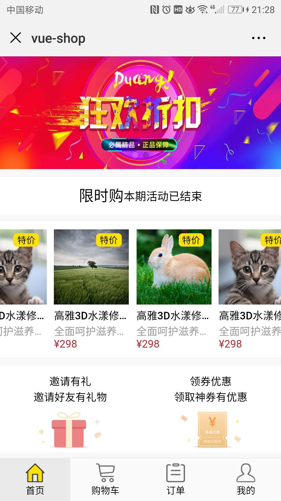
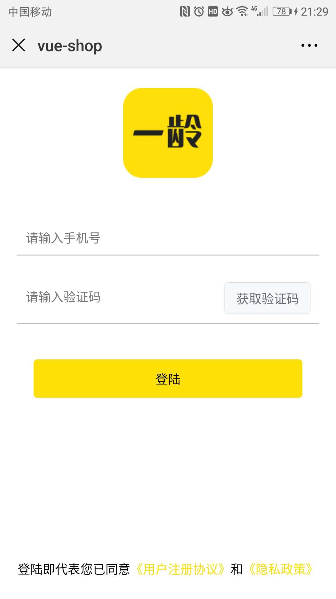
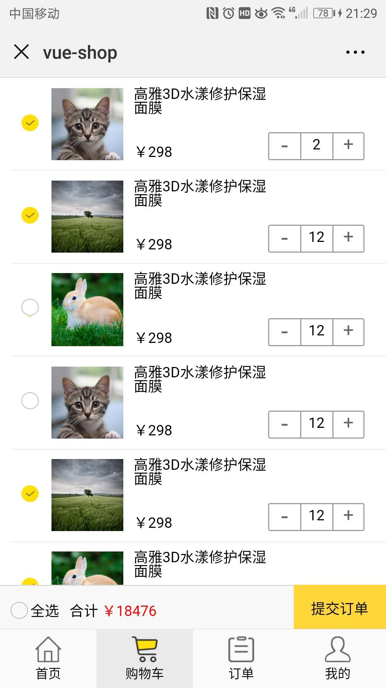
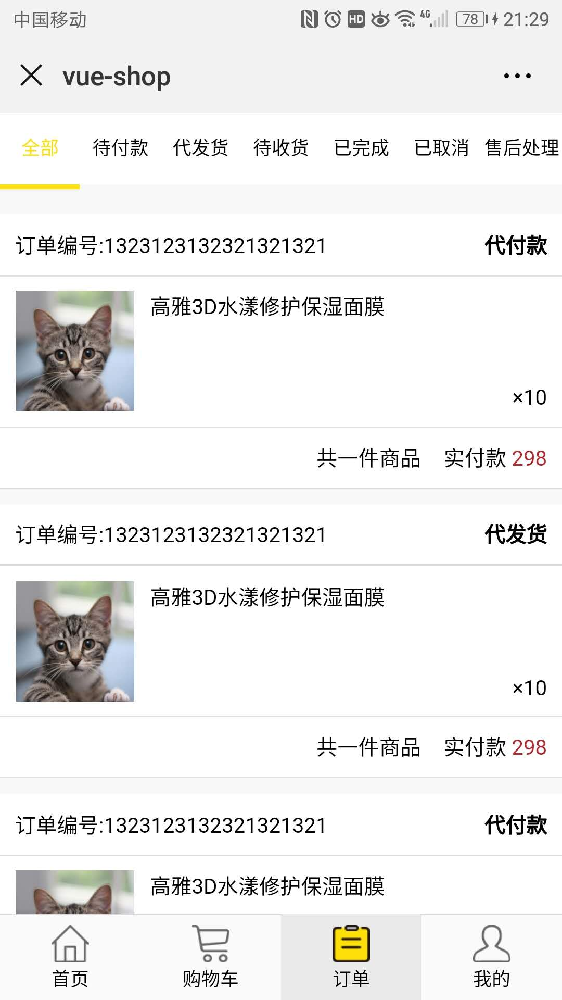
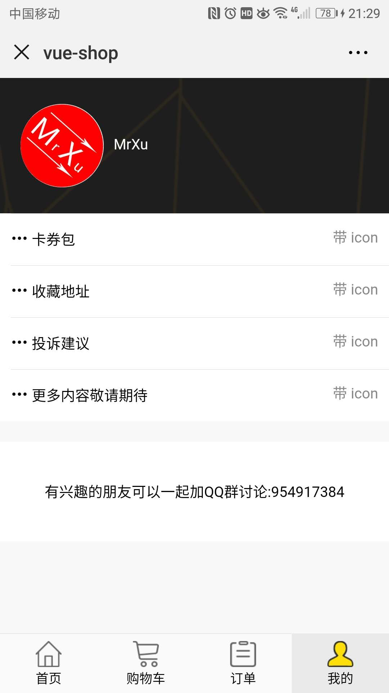
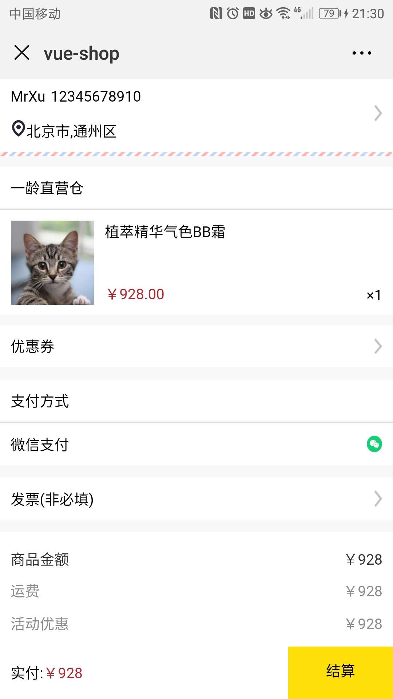

# vue 商城

> 具体的业务跟一龄还差很多，不过也算是可以闭环了。就先发出来吧，后期我会上桌面端管理项目和node后端服务项目。三个项目搞在一块形成一个闭环

## 项目地址 [http://xuyuechao.top](http://xuyuechao.top)

## 项目效果图展示
{:width:100px}

## 项目使用步骤

1. git clone https://github.com/mrxu0/vue-ylbs-shop.git
2. cd vue-ylbs-shop
3. npm install
4. npm start
5. 生产环境包: npm run build

## 反馈地址 :[https://github.com/mrxu0/vue-ylbs-shop/issues](https://github.com/mrxu0/vue-ylbs-shop/issues)

## 交流沟通可以加QQ群: 954917384
